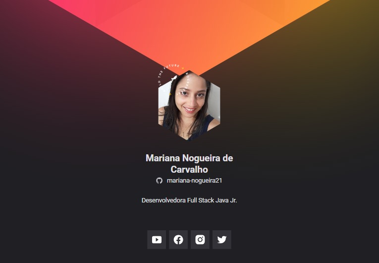

# 🔥 Crachá Virtual - NLW Heat

Este projeto foi desenvolvido durante a **trilha Origin** da **Next Level Week Heat** da [Rocketseat](https://rocketseat.com.br/). A proposta era criar um crachá virtual estilizado, utilizando tecnologias web modernas.

## ✨ Preview

Você pode ver o crachá em ação [aqui](https://mariana-nogueira21.github.io/cracha-nlw/)!



## 🛠️ Tecnologias utilizadas

- HTML
- CSS
- JavaScript

## 🚀 Como rodar o projeto

1. Clone o repositório:
   ```bash
   git clone https://github.com/mariana-nogueira21/cracha-nlw.git
